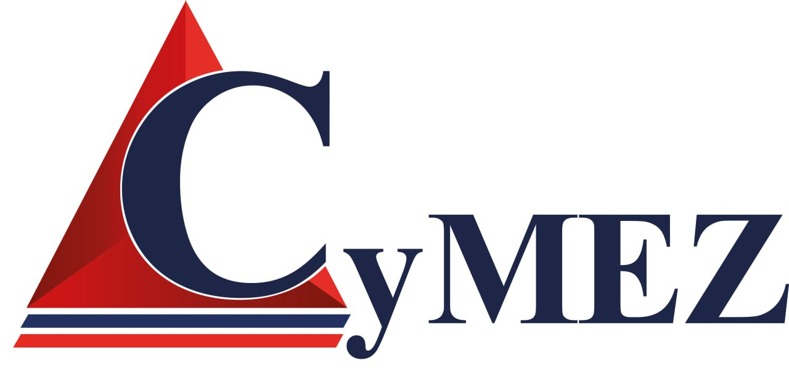

# CyMEZ – Seguridad Privada Nivel Pro  
¡Bienvenido al repositorio de CyMEZ! Prepárate para descubrir qué hace única a esta empresa.

## ¿Quiénes somos?

CyMEZ (Cymez S.A. de C.V.), fundada en 1997, es una empresa de **seguridad privada** con visión futurista: proveemos **personal, tecnología y procesos** de protección a industrias clave como **manufactura, petroquímica y energética** :contentReference[oaicite:0]{index=0}.

Con sede matriz en Reynosa, Tamaulipas, y presencia robusta en Nuevo León, Querétaro y Guanajuato, somos pioneros en el mercado fronterizo mexicano y fuimos la primera empresa privada en México en exportar servicios de seguridad privada a Estados Unidos :contentReference[oaicite:1]{index=1}.

## Nuestros Servicios

Ofrecemos una cartera completa y afila:
- Investigación y *risk assessment* (evaluación de riesgos).  
- Protección ejecutiva (escoltas).  
- Custodia de personal y carga.  
- Monitoreo remoto.  
- Consultoría especializada en seguridad.  
La lista no se queda corta: cubrimos desde lo físico hasta lo digital :contentReference[oaicite:2]{index=2}.

## Cobertura

Operamos desde la frontera sur del país hacia el centro:
- **Matriz**: Reynosa, Tamaulipas.  
- **Presencias**: Nuevo León, Querétaro y Guanajuato :contentReference[oaicite:3]{index=3}.

## Certificaciones y Permisos

Porque lo que importa es hacerlo bien y con reconocimiento:
- **Certificaciones**:
  - BASC MEXGDL00162-1-9  
  - ISO 9001:2015 (ER-0176/2012)  
  - IQNET ES-0176/2012  
  - D&B D-U-N-S: 81-263-4681 :contentReference[oaicite:4]{index=4}

- **Permisos**:
  - Estatal Tamaulipas 28-042-2020  
  - Federal DGSP/264-11/1875  
  - Municipal Silao, GTO. 0313-III-33/2020  
  - Estatal Nuevo León DCSESP-502-20/I-II  
  - Estatal Querétaro S.S.C./S.S.P./402 :contentReference[oaicite:5]{index=5}

## Contacto

Haz equipo con nosotros:
- Dirección: 16 de septiembre #800, Col. Longoria, Reynosa, Tamaulipas, C.P. 88660 :contentReference[oaicite:6]{index=6}  
- Teléfono: (899) 921-8770 ext. 114, 143  
- WhatsApp: 8998 783 751  
- Correo: *[info@cymez.com](mailto:info@cymez.com)*  
- Línea ética para anonimato y alta ética corporativa (si ves algo raro, dilo aquí) :contentReference[oaicite:7]{index=7}

## Vision & Futuro

Ser la seguridad del mañana, hoy. Innovamos con tecnología, ética y agilidad – siempre un paso adelante para proteger lo que más importa.
