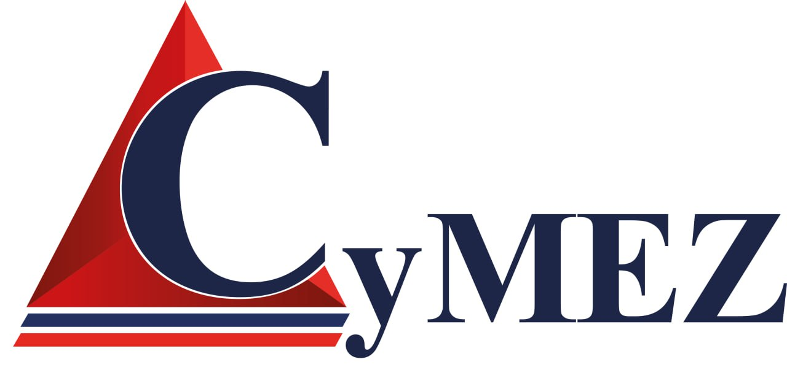

# CyMEZ

> Seguridad privada para entornos industriales y corporativos.

---

## 🛡️ Sobre Nosotros

**CyMEZ (Cymez S.A. de C.V.)** es una empresa de seguridad privada fundada en 1997, especializada en la protección de sectores como manufactura, petroquímica y energía.

Integramos **personal capacitado**, **tecnología** y **procesos estructurados** para operar en entornos de alto riesgo.

---

## ⚙️ Capacidades

* Investigación y evaluación de riesgos
* Protección ejecutiva
* Custodia de personal y carga
* Monitoreo remoto
* Consultoría en seguridad

---

## 🌎 Presencia

* **Matriz:** Reynosa, Tamaulipas
* **Cobertura:** Nuevo León · Querétaro · Guanajuato

---

## 📄 Certificaciones

* BASC MEXGDL00162-1-9
* ISO 9001:2015 (ER-0176/2012)
* IQNET ES-0176/2012
* D&B D-U-N-S: 81-263-4681

---

## 📬 Contacto

* 🌐 https://www.cymez.com
* 📧 [info@cymez.com](mailto:info@cymez.com)

> Canal institucional disponible para comunicación general.

---

## 🧭 Enfoque

Operamos bajo estándares internacionales, con énfasis en prevención, control de riesgos y mejora continua.

---

  © CyMEZ · Seguridad Privada

